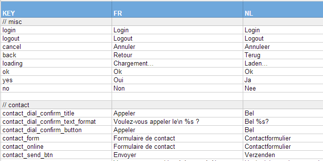
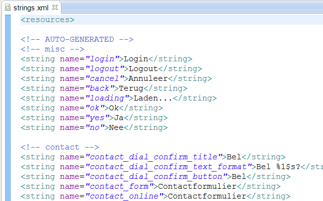

# Convert a Google Spreadsheet to a localization file

## Installation
	npm install localize-with-spreadsheet

## Example
Given a Google Spreadsheet like this:

The tool fetch the spreadsheet and write the result to a file in the Android or iOS format:
 

Create a file update-localization.js
	var Gs2File = require("localize-with-spreadsheet");

    var transformer = Gs2File.fromGoogleSpreadsheet("0Aq6WlQdq71FydDZlaWdmMEUtc2tUb1k2cHRBS2hzd2c", '*');
    transformer.setKeyCol('KEY');

    transformer.save("values/strings.xml", { valueCol: "NL", format: "android" });
    transformer.save("values-fr/strings.xml", { valueCol: "FR", format: "android" });

    transformer.save("nl.lproj/Localizable.strings", { valueCol: "NL", format: "ios" });
    transformer.save("fr.lproj/Localizable.strings", { valueCol: "FR", format: "ios" });

## Advanced
You can filter the worksheets to include with the second parameter of 'fromGoogleSpreadsheet'
Ex:
    Gs2File.fromGoogleSpreadsheet("<Key>", '*');
    Gs2File.fromGoogleSpreadsheet("<Key>", ['HomeScreen, 'ContactScreen']);
    Gs2File.fromGoogleSpreadsheet("<Key>", [0, 2]);
